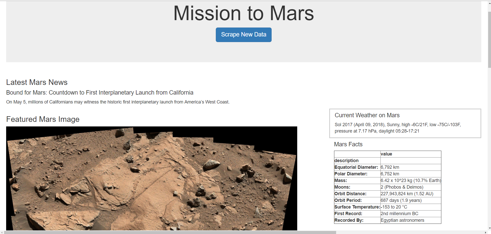

### Mission To Mars

Built a web application that scrapes data, images, and tables from various websites (NASA Mars News, Jet Propulsion Laboratory, 
Mars Weather Twitter Account, USGS Astrogeology) related to the Mission to Mars and displays the information in a single HTML page.
Used MongoDB with Flask templating to create a new HTML page that displays all of the information that was scraped from the URLs above.

Languages and Tools:
- Pandas
- API Calls
- Jupyter Notebook
- HTML
- ChromeDriver
- CSS
- MongoDB
- Flask
- Requests/Splinter
- BeautifulSoup

